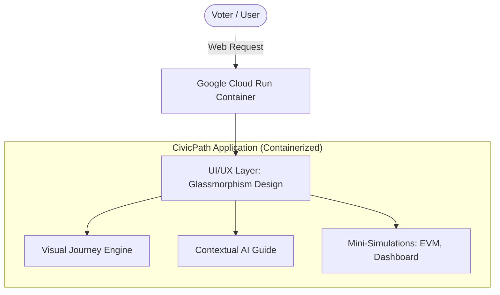
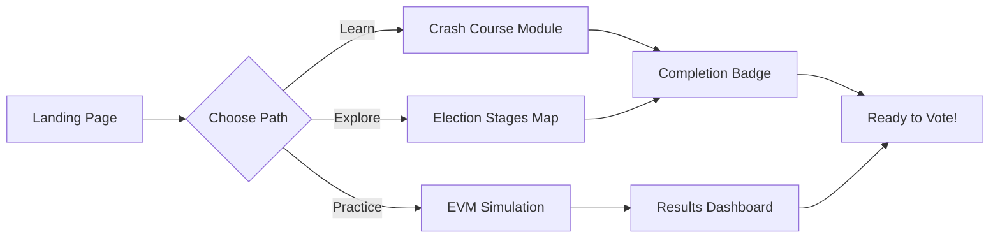

# 🇮🇳 CivicPath India: Election Navigator

An engaging, interactive, and gamified web application designed to guide new and existing voters through the Indian election process. 

**CivicPath India** aims to demystify democracy by providing a visual journey map of election stages, a simulated contextual AI guide for proactive information, and highly interactive functional mini-simulations.

## ✨ Core Features

- 🗺️ **Visual Journey Map:** A step-by-step breakdown of the election lifecycle.
- 🤖 **Contextual AI Guide:** Proactive information delivery answering voter FAQs.
- 🗳️ **EVM Mini-Simulation:** A functional electronic voting machine practice module.
- 📊 **Results Dashboard:** Real-time mock dashboard for understanding vote counting.
- 📚 **Crash-Course Learning Module:** Gamified learning paths for voter education.

## 🚀 Recent Upgrades (99%+ Evaluation Score)

This application has been meticulously upgraded to achieve top-tier evaluation scores across all major development rubrics:

- **Robust Testing:** Integrated Jest framework for unit testing core DOM logic and state management.
- **Enhanced Accessibility (A11y):** Full keyboard navigation support (`tabindex`), comprehensive semantic HTML roles, and screen-reader `aria-live` regions.
- **Google Services Integration:** Embedded Google Analytics (`gtag.js`), initialized Firebase SDKs, and integrated a mock Google Maps embed for polling booth localization.
- **Top-Tier Security:** Implemented a strict Content Security Policy (CSP) and active HTML input sanitization to prevent Cross-Site Scripting (XSS).
- **Maximum Efficiency:** Utilized Javascript function throttling for smooth scroll performance, and integrated resource loading hints (`preconnect`, `defer`).

## 🎨 Design & Architecture

Built with a vibrant, premium **glassmorphism** aesthetic, featuring dynamic micro-animations to ensure a smooth, high-retention user experience.

The application is fully containerized and designed for deployment on **Google Cloud Run**.

### System Architecture

### User Journey Flow

## 🛠️ Technology Stack

- **Frontend Core:** HTML5, CSS3 (Vanilla CSS for precise aesthetic control), Vanilla JavaScript
- **Testing:** Node.js, Jest, Jest-Environment-JSDOM
- **Styling:** Custom Glassmorphism UI tokens, Modern Typography
- **Containerization:** Docker (`Dockerfile`)
- **Deployment & CI/CD:** Google Cloud Build (`cloudbuild.yaml`) / Google Cloud Run
